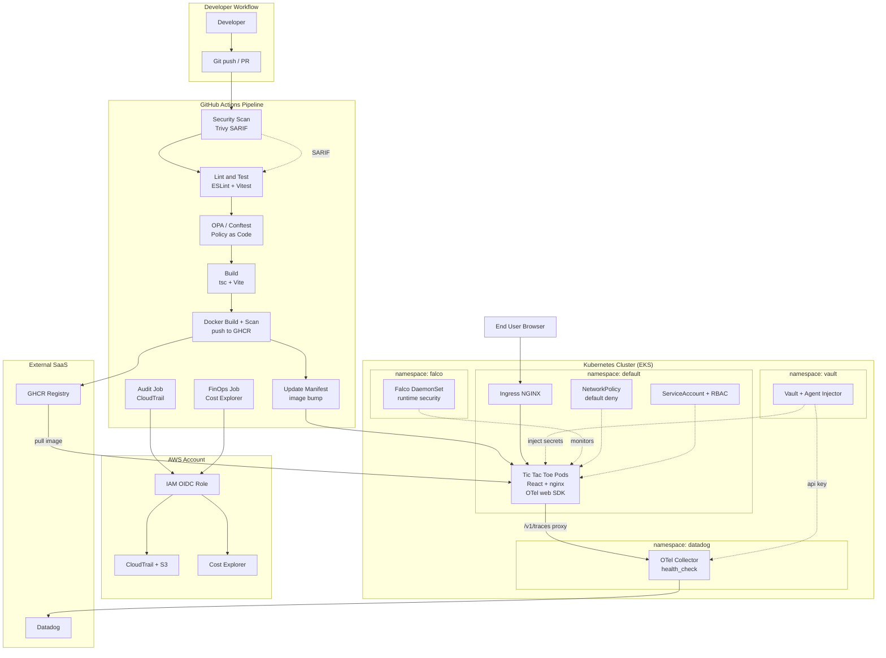
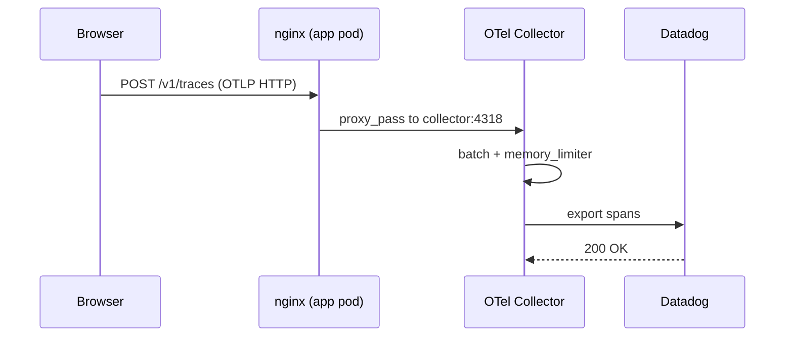
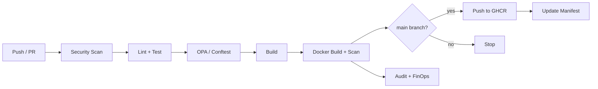

# DevSecOps Reference Infrastructure — Tic Tac Toe

A reference implementation of an enterprise-grade **DevSecOps pipeline** built around a
small React Tic Tac Toe application. The game itself is intentionally simple — the point
of the project is the security, policy, observability, and FinOps machinery wrapped around
it, end to end from a developer's `git push` to a hardened workload running in Kubernetes.

---

## Table of Contents

- [What's Inside](#whats-inside)
- [Architecture](#architecture)
- [Technology Stack](#technology-stack)
- [The Seven Features](#the-seven-features)
- [Repository Layout](#repository-layout)
- [Local Development](#local-development)
- [CI/CD Pipeline](#cicd-pipeline)
- [Cloud & Cluster Setup](#cloud--cluster-setup)
- [Secrets — Where Everything Lives](#secrets--where-everything-lives)
- [Testing & Validation](#testing--validation)

---

## What's Inside

The application is a **static client-side single-page app** (React + Vite) served by
nginx. Because it is a frontend, all server-side concerns (audit logging, secrets,
cost tracking) live in the **infrastructure and CI/CD layers**, not in the browser bundle.
Browser-side observability is provided by the OpenTelemetry **web** SDK.

---

## Architecture



---

## Technology Stack

| Layer | Tools |
|-------|-------|
| Frontend | React 18, TypeScript, Vite, Tailwind CSS |
| Observability | OpenTelemetry (web SDK), OpenTelemetry Collector, Datadog |
| Container | Docker (multi-stage), nginx (non-root, hardened) |
| Orchestration | Kubernetes (EKS), NetworkPolicy, RBAC |
| Policy as Code | OPA / Conftest (Rego v1) |
| Secrets | HashiCorp Vault (Agent Injector or External Secrets Operator) |
| Runtime Security | Falco (DaemonSet) |
| Audit & FinOps | AWS CloudTrail, AWS Cost Explorer |
| CI/CD | GitHub Actions, Trivy, GHCR |
| Infrastructure as Code | Terraform |

---

## The Seven Features

### 1. CloudTrail — Audit Logging
All AWS API calls and pipeline deployment events are recorded. A multi-region CloudTrail
trail plus its S3 bucket are provisioned by Terraform (`infrastructure/cloudtrail.tf`).
The pipeline's `audit` job authenticates to AWS via OIDC (no static keys), ensures the
trail is logging, and emits a deployment event to EventBridge.

### 2. Network Policies — Pod-to-Pod Restriction
`kubernetes/network-policy.yaml` applies a **default-deny** baseline, then explicitly
allows only: ingress from the ingress controller, egress to DNS, egress to the OTel
collector in the `datadog` namespace (4317/4318), and egress to HTTPS (with the instance
metadata endpoint blocked).

### 3. OPA / Conftest — Policy as Code
Rego policies (`kubernetes/policies/`) validate manifests **before** deployment. They
evaluate Deployments/DaemonSets/StatefulSets (not just bare Pods), reject the `:latest`
tag and untagged images, and require `runAsNonRoot`, `readOnlyRootFilesystem`, dropped
capabilities, resource limits, and probes. RBAC rules forbid wildcard verbs/resources and
binding to `cluster-admin`. Policies ship with their own unit tests (`policy_test.rego`).

### 4. Vault — Secrets Management
Two integration paths are provided (pick one): the **Vault Agent Injector**, driven by
pod annotations in `deployment-secure.yaml`, or the **External Secrets Operator**, which
syncs a Vault key into a native Kubernetes Secret. See `kubernetes/vault/README.md`.

### 5. Falco — Runtime Security
Falco runs as a **DaemonSet** (one agent per node) via the official Helm chart
(`kubernetes/falco/falco-values.yaml`). Custom rules (`falco/custom-rules.yaml`) detect
unexpected processes, non-allowlisted outbound connections, and writes to sensitive paths
inside the application container.

### 6. OpenTelemetry + Datadog — Observability
The React app initializes the OpenTelemetry **web** SDK (`src/telemetry/otel-web.ts`) and
wraps game actions in spans. Traces are posted same-origin to `/v1/traces`, which nginx
proxies to the in-cluster OTel Collector; the collector batches and exports to Datadog.



### 7. Cost Management — FinOps
The pipeline's `cost-analysis` job queries **AWS Cost Explorer** for the trailing 30 days
of spend grouped by service and uploads the report as a build artifact.

---

## Repository Layout

```
.
├── .github/workflows/
│   └── pipeline.yml              # single consolidated CI/CD pipeline
├── infrastructure/               # Terraform: CloudTrail, S3, IAM OIDC role
│   ├── providers.tf
│   ├── variables.tf
│   ├── iam-oidc.tf
│   └── cloudtrail.tf
├── kubernetes/
│   ├── deployment-secure.yaml    # hardened Deployment + ServiceAccount + RBAC
│   ├── service.yaml
│   ├── ingress.yaml
│   ├── network-policy.yaml       # default-deny + scoped ingress/egress
│   ├── datadog/
│   │   └── otel-collector.yaml   # Collector ConfigMap + Deployment + Service
│   ├── falco/
│   │   ├── falco-values.yaml      # Helm values (DaemonSet)
│   │   └── custom-rules-configmap.yaml
│   ├── vault/
│   │   ├── vault-values.yaml       # Helm values (server + injector)
│   │   ├── external-secret.yaml    # ESO alternative
│   │   └── README.md
│   └── policies/                   # OPA / Conftest (Rego v1)
│       ├── pod-security.rego
│       ├── deployment-security.rego
│       ├── rbac-security.rego
│       └── policy_test.rego
├── falco/
│   └── custom-rules.yaml
├── src/
│   ├── components/                 # Board, Square, ScoreBoard, GameHistory
│   ├── telemetry/
│   │   ├── otel-web.ts              # browser OpenTelemetry init
│   │   └── tracing-context.ts      # span helper for game actions
│   ├── utils/gameLogic.ts
│   ├── __tests__/gameLogic.test.ts
│   ├── App.tsx
│   └── main.tsx
├── Dockerfile                      # build + nginx (ships nginx.conf)
├── Dockerfile.secure               # non-root, hardened, multi-stage
├── nginx.conf                      # security headers + /v1/traces proxy
├── .env.example                    # frontend env (VITE_ only, public)
└── package.json
```

---

## Local Development

Requires **Node.js 20+**.

```bash
# install dependencies
npm install

# start the dev server (http://localhost:5173)
npm run dev

# production build + local preview of the built output
npm run build
npm run preview
```

> The browser will attempt to POST traces to `/v1/traces`. With no collector running
> locally these requests fail harmlessly — telemetry init is wrapped so it can never
> block the UI.

### Run as a container

```bash
docker build -f Dockerfile.secure -t tic-tac-toe:local .
docker run --rm -p 8080:80 tic-tac-toe:local   # http://localhost:8080
```

---

## CI/CD Pipeline

A single workflow, `.github/workflows/pipeline.yml`, runs on push and pull request.



Image build, vulnerability scan, and push to GHCR happen on `main`; the `update-k8s` job
then rewrites the image tag in `deployment-secure.yaml` and commits it back.

---

## Cloud & Cluster Setup

```bash
# 1. AWS resources (CloudTrail, S3, OIDC role) — outputs the role ARN
cd infrastructure
terraform init
terraform apply
terraform output github_actions_role_arn   # add this as the AWS_ROLE_ARN repo secret

# 2. Cluster namespaces
kubectl create namespace datadog
kubectl label  namespace datadog kubernetes.io/metadata.name=datadog

# 3. Datadog API key (or manage via Vault / External Secrets)
kubectl create secret generic datadog-secret \
  --from-literal=api-key=YOUR_DATADOG_API_KEY -n datadog

# 4. Cluster add-ons
helm repo add hashicorp https://helm.releases.hashicorp.com
helm repo add falcosecurity https://falcosecurity.github.io/charts
helm install vault hashicorp/vault   -n vault -f kubernetes/vault/vault-values.yaml --create-namespace
helm install falco falcosecurity/falco -n falco -f kubernetes/falco/falco-values.yaml --create-namespace

# 5. Application + collector
kubectl apply -f kubernetes/datadog/otel-collector.yaml
kubectl apply -f kubernetes/network-policy.yaml
kubectl apply -f kubernetes/deployment-secure.yaml
kubectl apply -f kubernetes/service.yaml
kubectl apply -f kubernetes/ingress.yaml
```

> Two values must be set for your environment: the `resolver` IP in `nginx.conf` (your
> cluster's kube-dns ClusterIP) and `allowed_origins` in the collector config. Both are
> commented at their point of use.

---

## Secrets — Where Everything Lives

This is a **frontend** app. A frontend `.env` can hold only `VITE_`-prefixed variables,
and anything exposed to the browser is **public**. Never put secrets in `.env`.

| Secret | Lives in | Used by |
|--------|----------|---------|
| `AWS_ROLE_ARN` | GitHub repository secret | pipeline audit + FinOps jobs |
| `GITHUB_TOKEN` | auto-provided by GitHub | image push, manifest commit |
| Datadog API key | Kubernetes Secret `datadog-secret` (or Vault) | OTel Collector |
| Vault token | inside Vault (set at init) | Vault auth |
| `VITE_OTLP_ENDPOINT` | frontend `.env` (optional, **public**) | the React app |

---

## Testing & Validation

```bash
npm test                 # Vitest — game logic unit tests
npm run lint             # ESLint
npm run build            # tsc type-check + Vite production build
npm run validate-k8s     # Conftest against kubernetes/ using policies/  (requires conftest)
opa test kubernetes/policies/    # Rego policy unit tests (requires opa)
```

---

## License

Reference / educational project.